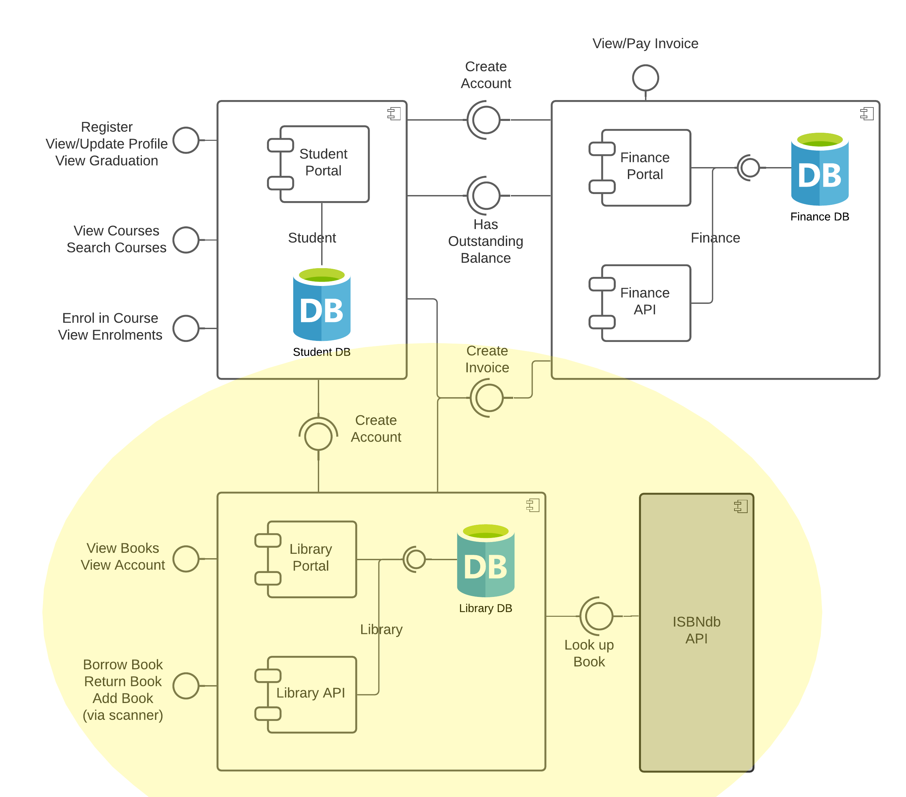

# Library Portal, cloned from [CESBooks](https://github.com/tvergilio/CESBooks) by [tvergilio](https://github.com/tvergilio). 
## Modified to work with my StudentPortal and Finance Microservices

A microservices-based web application to manage a university library.
The application is written in Python using the Flask framework.

## Library Student Features
1. Login - secure password-verified login.
2. Books - display all books in the library.
3. Borrow - borrow a book using barcode scanner.
4. Return - return a book using thebarcode scanner.
5. Account - display the user's borrowng history.

## Integrations
### 1. Database
The application integrates with a MySQL relational database. 
The connection string is set in the application.py file. 
Scripts to create the database schema can be found in the migrations folder.

### 2. Finance
The application integrates with the [Finance microservice](https://github.com/albert-tarkaa/FinancePortal) via REST.
1. When a book is returned late, a fine is issued. A request is sent to the Finance microservice to create an invoice. 
2. The invoice must be paid via the Payment Portal.

### 3. Student
The application integrates with the [Student microservice](https://github.com/albert-tarkaa/SESCStudentPortal) via REST.
1. When a student is created via the Student microservice, a request is sent to this application to create an account for the student.
2. The default library pin for all new accounts is '000000' (see API above).

## License
Permission is hereby granted, free of charge, to any person obtaining a copy
of this software and associated documentation files (the "Software"), to deal
in the Software without restriction, including without limitation the rights
to use, copy, modify, merge, publish, distribute, sublicense, and/or sell
copies of the Software, and to permit persons to whom the Software is
furnished to do so, subject to the following conditions:

The above copyright notice and this permission notice shall be included in all
copies or substantial portions of the Software.

THE SOFTWARE IS PROVIDED "AS IS", WITHOUT WARRANTY OF ANY KIND, EXPRESS OR
IMPLIED, INCLUDING BUT NOT LIMITED TO THE WARRANTIES OF MERCHANTABILITY,
FITNESS FOR A PARTICULAR PURPOSE AND NON-INFRINGEMENT. IN NO EVENT SHALL THE
AUTHORS OR COPYRIGHT HOLDERS BE LIABLE FOR ANY CLAIM, DAMAGES OR OTHER
LIABILITY, WHETHER IN AN ACTION OF CONTRACT, TORT OR OTHERWISE, ARISING FROM,
OUT OF OR IN CONNECTION WITH THE SOFTWARE OR THE USE OR OTHER DEALINGS IN THE
SOFTWARE.
